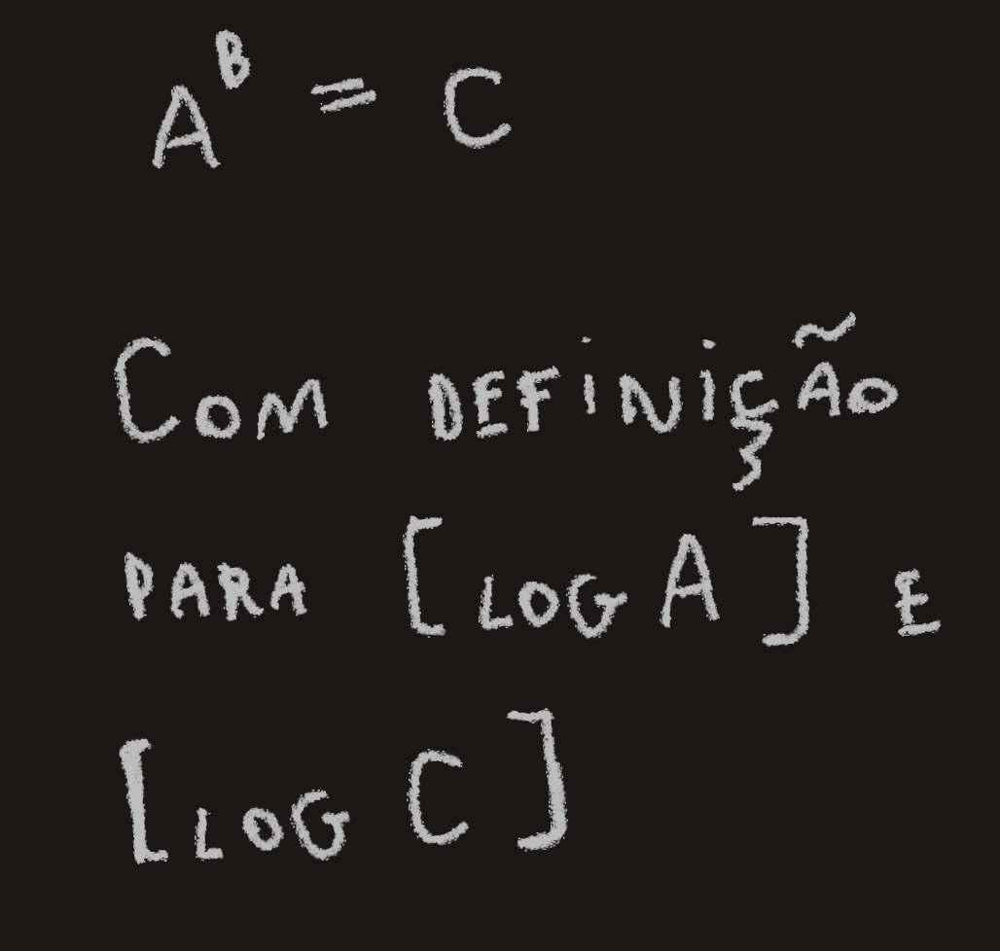
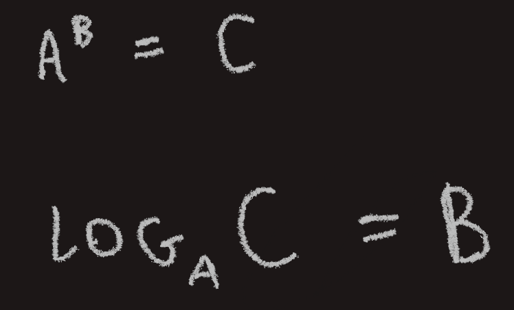
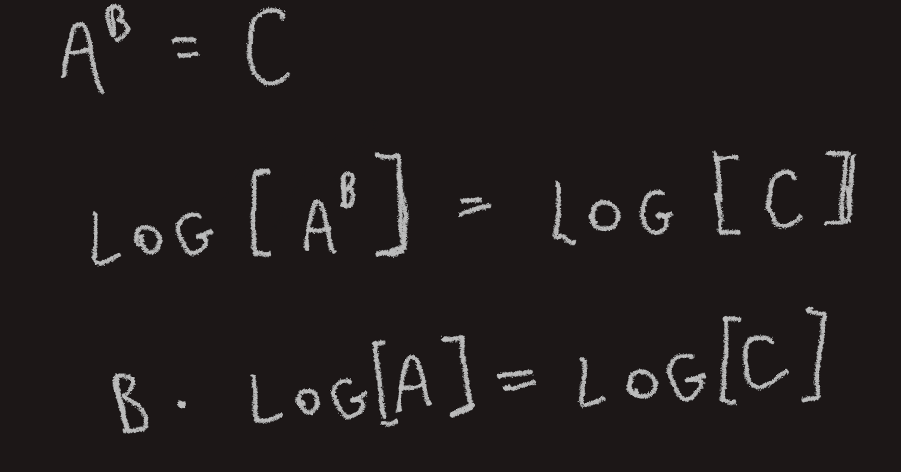
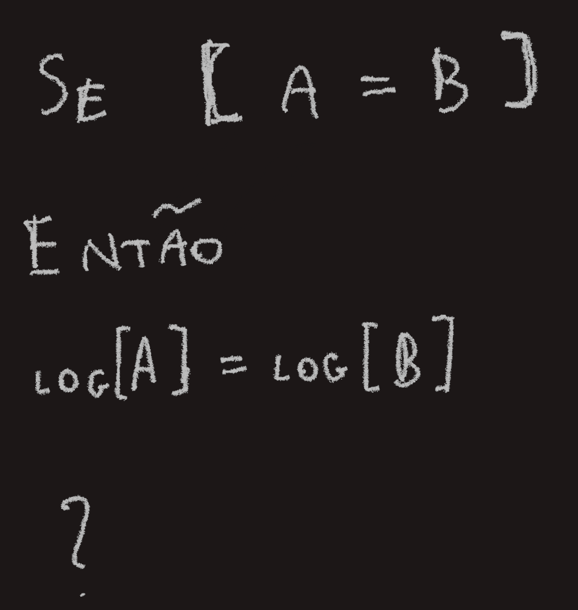
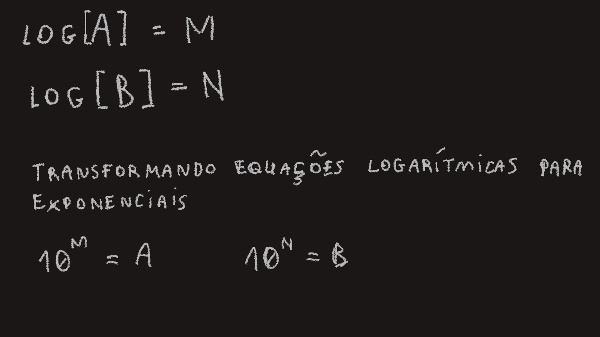
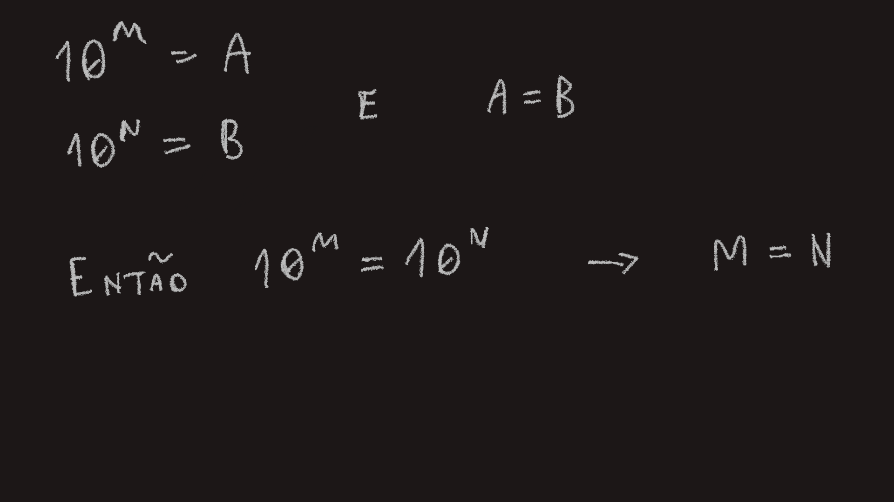

# Logaritmos

Resolvendo um problema, me deparei com uma equação semelhante à seguinte:

Minha abordagem inicial foi a de transformar essa equação exponencial numa equação logarítmica. No entanto, não seria possível explorar os valores de log[A] e log[C] para encontrar [B].

Outra abordagem foi aplicar a operação de logarítimo em ambos os lados da igualdade e substituir os valores de log[A] e log[B] para encontrar o valor de [B].

Isso me levantou a seguinte questão

Isso parece óbvio. A igualdade se mantém pois mesma operação foi aplicada a ambos os lados.

Mesmo assim, eu continuei manipulando essa equação.

Agora, cheguei numa parte bela. Lembrando da premissa inicial de que [A = B], voltei à premissa óbvia de que [log[A] = log[B]].

Perceba que [M] e [N] são valores arbitrários que igualei à log[A] e log[B].

[hello](math/2024-08-08-19-49-00.png)